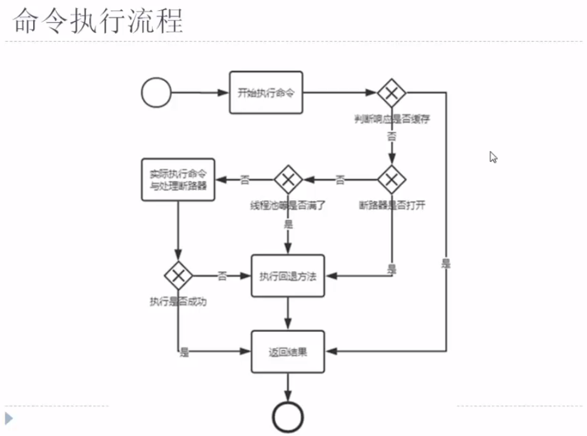

## Hystrix 的使用 （二）断路器

#### 1. 命令执行流程



即命令执行请会经过三个判断：**缓存 、断路器状态、线程池**

#### 2. [断路器的开启](https://github.com/Netflix/Hystrix/wiki/Configuration#circuit-breaker)

* **整个链路达到一定的阀值，默认情况下，10秒内产生超过20次请求，则符合第一个条件**
* **满足第一个条件的情况下，如果请求的错误百分比大于阀值，则会打开断路器，默认为50%**
  测试类：[CircuitBreakerOpenTest.java](./src/main/java/org/orh/spring/cloud/ch206/CircuitBreakerOpenTest.java)

#### 3. 断路器的关闭

断路器在打开后，在一段时间内不会关闭，在**一段的时间内**总是执行fall back方法，这段时间称之为**休眠期**，默认为`5s`, 其后Hystrix会尝试执行一次命令，断路器状态进入“半开”状态，如果执行成功，则关闭断路器，清除健康信息，如果命令尝试执行失败，断路器仍为打开状态。

（这应该算是BackOff退避算法中的，固定时间间隔重试吧）

#### **BackOff退避算法实现(Spring 4.1新特性)**

在如连接网络的应用中，网络是不稳定的有时候会连接断开，因此为了保证断开重连接；还有如系统之间互联，相互之间发生消息，如果某个服务器因为不确定因此连接不上，也需要断开重连；则需要一定的规则；常见的规则有：

1. 按照固定时间间隔重试，比如100毫秒；这种方式在网络不稳定时重连可能造成某一时间点流量同时发送，阻塞网络；或者造成发送一些无意义的请求；

   ```java
   @Test  
   public void testFixedBackOff() {  
       long interval = 100;  
       long maxAttempts = 10;  
       BackOff backOff = new FixedBackOff(interval, maxAttempts);  
       BackOffExecution execution = backOff.start();  
     
       for(int i = 1; i <= 10; i++) {  
           //每次重试时间是100毫秒  
           System.out.println(execution.nextBackOff());  
       }  
       Assert.assertEquals(BackOffExecution.STOP, execution.nextBackOff());  
   }  
   ```

   * interval是重试间隔
   * maxAttempts是最大重试次数
     如果重试到了maxAttempts，则execution.nextBackOff()=BackOffExecution.STOP。

2. 按照指数时间间隔重试，比如刚开始100毫秒，下一次200毫秒等；比如支付宝和第三方集成时就是类似方式。

   ```java
   @Test  
   public void testExponentialBackOff() {  
       long initialInterval = 100;//初始间隔  
       long maxInterval = 5 * 1000L;//最大间隔  
       long maxElapsedTime = 50 * 1000L;//最大时间间隔  
       double multiplier = 1.5;//递增倍数（即下次间隔是上次的多少倍）  
       ExponentialBackOff backOff = new ExponentialBackOff(initialInterval, multiplier);  
       backOff.setMaxInterval(maxInterval);  
       //currentElapsedTime = interval1 + interval2 + ... + intervalN;  
       backOff.setMaxElapsedTime(maxElapsedTime);  
     
       BackOffExecution execution = backOff.start();  
     
       for(int i = 1; i <= 18; i++) {  
           System.out.println(execution.nextBackOff());  
       }  
       Assert.assertEquals(BackOffExecution.STOP, execution.nextBackOff());  
   }  
   ```

   ​

