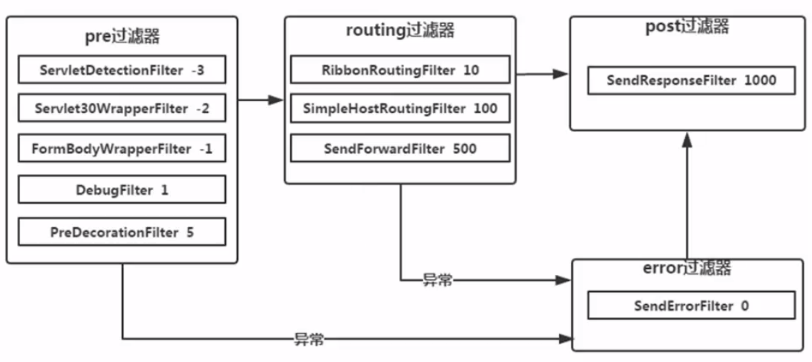

## 网关 Zuul（四）功能进阶

Zuul的请求分为多个阶段，每个阶段会提供多个过滤器，其中负责路由的是一个叫做routing的过滤器。

源码在 [ch-03-03](../ch-03-03/spring-zuul-eu-server2/src/main/java/org/orh/spring/cloud/ch303/EurekaServerApp.java) 中


#### 自定义过滤器

从源码`FilterConstant`中高可用看到`Zuul Filter TYPE constants `，共定义了4中过滤器类型。



routing中的过滤器最终会选择一个来执行。 

过滤器的作用：

```java
public boolean shouldFilter() {
  RequestContext ctx = RequestContext.getCurrentContext();
  HttpServletRequest request = ctx.getRequest();
  String uri = request.getRequestURI();
  // 我们可以通过uri、cookie、request headers 等信息针对一些特殊的请求做另类处理
  if (uri.indexOf("rest-tpl-safe") != -1) {
    return true;
  } else {
    return false;
  } 
}
public Object run() {
  RequestContext ctx = RequestContext.getCurrentContext();
  String serviceId = (String)ctx.get("serviceId");
  String requestUri = (String)ctx.get("RequestURI");
  // 组合成url个RestTemplate调用
  String url = "http://" + serviceId + uri;
  System.out.println("执行RestTemplateFilter，调用url：" + url);
  String result = restTemplate.getForObject(url, String.class);
  // 设置路由状态，表示已经进行路由，后面的route 过滤器将不会再执行
  ctx.setResponseBody(result);
  ctx.sendZuulResponse();
  return null;
}
```


编写自定义过滤器：

```java
MyFilter extends ZuulFilter {
    @Override
    public String filterType() {
        return FilterConstants.ROUTE_TYPE;
    }

    @Override
    public int filterOrder() {
        return 5;
    }

    @Override
    public boolean shouldFilter() {
        RequestContext ctx = RequestContext.getCurrentContext();
        HttpServletRequest request = ctx.getRequest();
        System.out.println("get:" + ctx.get("ctx-key"));
        ctx.set("ctx-key", "test-value");
        System.out.println("shouldFilter url:" + request.getRequestURI());
        // 根据判断逻辑是否执行
        return true;
    }

    @Override
    public Object run() {
        RequestContext ctx = RequestContext.getCurrentContext();
        System.out.println(ctx.get("ctx-key"));
        System.out.println("执行自定义过滤器");
        return null;
    }
}
```


#### 动态加载

对于集群来说，网关需要长期稳定体提供服务，重启网关代价太大，整个集群不可用，Zuul 支持使用 Groovy 编写脚本来支持动态加载。

* 添加`Groovy`依赖

  ```xml
  <dependency>
      <groupId>org.codehaus.groovy</groupId>
      <artifactId>groovy-all</artifactId>
      <version>2.4.13</version>
  </dependency>
  ```

  ​

* 在应用启动的时候，告诉`Zuul`要读取指定目录下的`groovy`脚本，定时读取脚本内容

参考：[Netflix Zuul Demo](https://github.com/Netflix/zuul/blob/1.x/zuul-simple-webapp/src/main/java/com/netflix/zuul/StartServer.java)

#### @EnableZuulServer 注解

* 与@EnableZuulProxy 的区别
  * pre 阶段不支持 `PreDecorationFilter`
  * routing阶段不支持，`RibbonRoutingFilter`、`SimpleHostRoutingFilter`

#### 动态路由

实现基础：

* 配置文件同步
* 配置动态加载

此处没有实现，后面spring cloud config 中再补充。