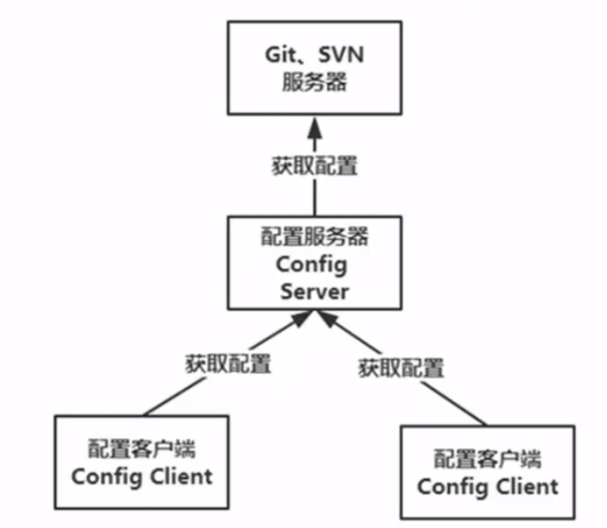

## 配置中心(一)概述

#### 解决的问题

* **对配置进行集中管理，版本记录**
* **修改配置，无需重启，配置刷新**

#### Spring Cloud Config 结构



* 服务器
  * **提供访问配置的服务接口**
  * **对属性进行加密、解密**
* 客户端
  * **绑定配置服务器，使用远程的配置来初始化Spring容器**
  * **对属性进行加密、解密**
  * **属性改变时，可以对他们进行重新加载**
  * **提供了与配置相关的几个管理端点**
  * **在初始化引导程序上下文时，进行绑定配置服务器和属性解密等工作**

#### 引导上下文

Spring Cloud 项目中会有两个上下文：

* **org.springframework.context.annotation.AnnotationConfigApplicationContext**
* **org.springframework.boot.context.embeded.AnnotationConfigEmbeddedWebApplicationContext**

`bootstrap.yaml`：

```java
@Autowired
ApplicationContext ctx;
...
Enviroment env = ctx.getEnviroment();
System.out.println(env.getProperty("test.name")); 
// 1. get property from bootstrap.yaml 
// 2. get property form application.yaml ，application.yaml 会覆盖bootstrap.yaml配置
```

#### 版本控制服务

需要提供一个版本服务器，如 svn/git。svn 可以使用 `Visualsvn Server `来搭建，git可以使用`gitlab`或者网上提供的公共服务。