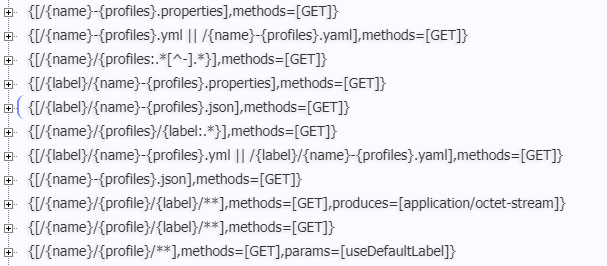

## 配置中心(二)第一个例子

#### 1. 创建一个本地的 git 仓库

打开`Git Bash`命令窗口 ，（非windows下打开Terminal即可）

```bash
$ cd $HOME
$ mkdir config-repo
$ cd config-repo
$ git init .
$ echo test.user.name=default > application.properties
$ echo test.user.name=dev > application-dev.properties
$ echo test.user.name=application-client-dev > applicatioin-client-dev.properties
$ echo test.user.name=spring-client-dev > spring-client-dev.properties
$ git add .
$ git commit -m "add test files"
```


#### 2. 服务端配置

1. [spring-config-server](spring-config-server) , 配置服务

   * 配置如下

     ```yaml
     server:
       # 客户端默认会访问8888端口，所以这里将服务配置在8888 端口
       port: 8888
     spring:
       cloud:
         config:
           server:
             git:
               uri: file://${user.home}/config-repo
     ```

   * 启用`@EnableConfigServer`

     ```java
     @SpringBootApplication
     @EnableConfigServer
     public class ConfigServer {
         public static void main(String[] args) {
             SpringApplication.run(ConfigServer.class, args);
         }
     }
     ```

   2. 测试：配置文件的访问
      - label ，非必须
      - **name，必须**
      - **profiles，必须**

查看下`mappings`端点：



其中常用的 `/{name}-{profiles}`，意味着你访问配置文件需要带上横线指定`profile`，你的文件如果没有

包含横线，也需要带上一个横线+profile来访问，比如目录下有`application.properties`文件：

通过访问`http://localhost:8888/application.properties`是无法返回内容的，

需要访问`http://localhost:8888/application-unknow.properties` 才可以返回内容

不过还是建议配置文件名是：`name-profile.[properties|yaml]`格式，比如默认的则使用:`application-default.properties`。

#### 3. 客户端配置

1. [spring-config-client](spring-config-client), 配置客户端
   `spring.cloud.config.name` > `spring.applicatoin.name` > `application`（default）

   * 引导程序的配置文件 `bootstrap.yaml`

     ```yaml
     spring:
       cloud:
         config:
           uri: http://localhost:8888
     ```

     访问：`http://127.0.0.1:8080/prop/test.user.name/` 返回，`application.properties`中的内容

   * 增加`profile`配置

     ```yaml
     spring.cloud.config.profile: dev
     ```

     访问：`http://127.0.0.1:8080/prop/test.user.name/` 返回，`application-dev.properties`中的内容

   * 增加`spring.application.name`配置，**覆盖默认读取`applicatoin.properties`的行为**

     ```properties
     spring.application.name=applicatoin-client
     ```

     访问：`http://127.0.0.1:8080/prop/test.user.name/` 返回，`application-client-dev.properties`中的内容

   * 增加`name`配置，会**覆盖读取`spring.application.name`的行为**

     ```properties
     spring.cloud.config.name: spring-client
     ```

     访问：`http://127.0.0.1:8080/prop/test.user.name/` 返回，`spring-client-dev.properties`中的内容

#### 4. 其他配置

**服务端配置目录、客户端配置文件**

* 读取多分配置：`spring.cloud.config.profile=hystrix,zuul,mysql`
* 客户端配置目录：`spring.cloud.config.label`


#### 5. 刷新配置

客户端加入`spring-boot-starter-actuator`，通过post请求访问端点`/refresh`进行刷新。

可以使用工具、或浏览器插件进行post请求，比如`postman` 发送post至 `http://localhost:8080/refresh`,git仓库中修改提交后，再次访问，注意查看每次的返回。没有修改时返回的是`[]`,如果有值修改会返回`["config.client.version", "..."]`

浏览器再次访问读取配置的接口http://127.0.0.1:8080/prop/test.user.name/`，将从`Enviroment`中读取最新提交的配置。

但是如果你是使用的 `@Value`注入的Spring Bean，是不会得到最新内容的，需要使用`@RefreshScope`来注解刷新Bean。

注意：

* 调用`/refresh` 端点会刷新，`@Environment`，即从该对象中能取出最新配置信息
* 如果Spring Bean使用的是 `@Value` 或其他配置类对象，则需要使用`@RefreshScope`来注解，如果有配置更新会将bean 重新构造一遍，可用`@PostConstruct`注解的方法来测试。