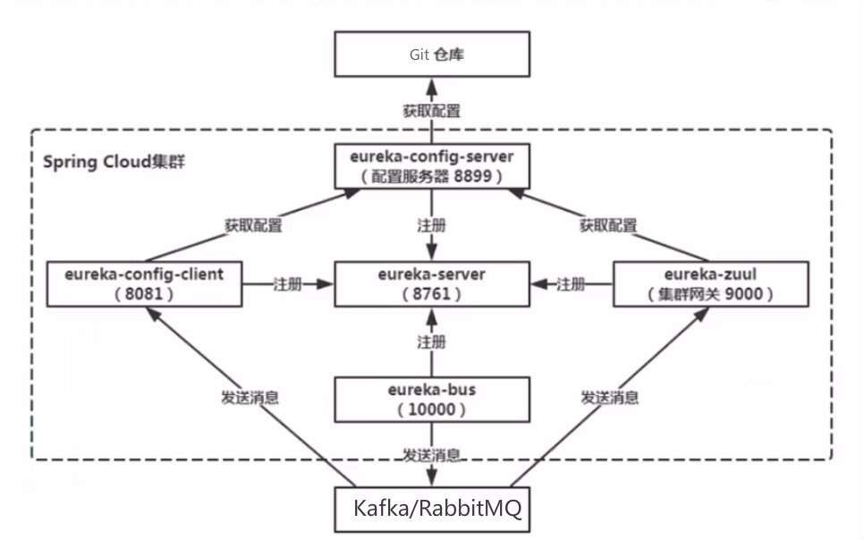
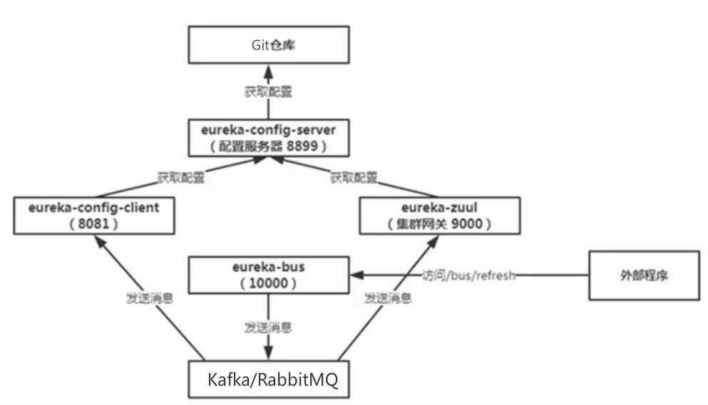
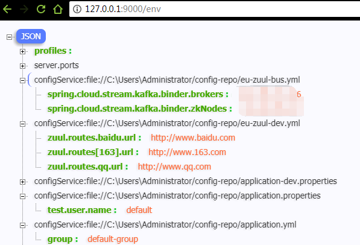

# 配置中心(五)整合Spring Cloud 使用配置中心

结构图：


根据结构图，依次新建以下项目：

* [eu-server](eu-server)，**服务注册中心** (因为之前章节模块都是在一个项目里的，已经存在eureka-server了，所以此处将上图中的`eureka-`前缀改为了`eu-`前缀来避免冲突)
  依赖：

  1. eureka服务中心主依赖：`org.springframework.cloud/spring-cloud-starter-netflix-eureka-server`

* [eu-config-server](eureka-config-server)，**配置中心，作为一项服务注册到eureka**
  依赖：

  1. Config Server主依赖：`org.springframework.cloud/spring-cloud-config-server` 
  2. eureka client 依赖：`org.springframework.cloud/spring-cloud-starter-netflix-eureka-client`

* [eu-config-client](eu-config-client)，**普通的服务，作为一项服务注册到eureka，同时要从配置中心读取配置**

  * 依赖：

  1. eureka client 依赖：`org.springframework.cloud/spring-cloud-starter-netflix-eureka-client`
  2. Config client 依赖：`org.springframework.cloud/spring-cloud-starter-config`
  3. 供刷新调用依赖：`org.springframework.boot/spring-boot-starter-actuator`

  * 不同于之前的config client 使用 uri指定配置服务地与端口，这里使用服务名：(**注意拉去远程配置都是在引导阶段，bootstrap.yml中配置**)

    ```yaml
    spring:
      cloud:
        config:
          discovery:
            enabled: true
            service-id: config-serviceId
    ```

* [eu-zuul](./eu-zuul)，集群网关，作为服务注册到eureka，同时从配置中心读取配置

  - 依赖：

  1. zuul依赖：`org.springframework.cloud/spring-cloud-starter-netflix-zuul`
  2. eureka client 依赖：`org.springframework.cloud/spring-cloud-starter-netflix-eureka-client`
  3. Config client 依赖：`org.springframework.cloud/spring-cloud-starter-config`
  4. 供刷新调用依赖：`org.springframework.boot/spring-boot-starter-actuator`


#### 整合Spring Cloud Bus，修改配置生效

之前我们需要重新读取配置时，需要调用配置客户端的`/refresh`来抓取服务器是否有更新配置，这样会有一些问题：

* 每个客户端都需要暴露`/refresh`来供我们写程序调用
* 逐个调用集群中的`/refresh`有失败、网络等问题都需要处理

可以使用`spring-cloud-bus`通过消息的机制来解决配置刷新的问题。

整合结构图：



我们只需要访问`/bus/refresh`来刷新整个集群的配置，`eureka-bus`作为消息的生产者，要刷新配置的项目`eureka-config-client`、`eureka-zuul`都作为消息的消费者，消费消息来加载最新配置。

新建项目：[eu-bus](eu-bus)，作为消息入口

* 依赖：
  * `org.springframework.cloud/spring-cloud-starter-bus-kafka` 或者是`org.springframework.cloud/spring-cloud-starter-bus-amqp`
  * eureka client 依赖：`org.springframework.cloud/spring-cloud-starter-netflix-eureka-client`

将需要刷新配置的项目增加`bus`依赖: 

* [eu-config-client](eu-config-client)增加： `org.springframework.cloud/spring-cloud-starter-bus-kafka`依赖
* [eu-zuul](./eu-zuul)增加： `org.springframework.cloud/spring-cloud-starter-bus-kafka`依赖

如果你的kafka/RabbitMQ不在本地，可以像以下这样来配置：

```yaml
spring:
  application:
    name: eu-bus
  cloud:
    stream:
      kafka:
        binder:
          brokers: 172.16.0.13
          zkNodes: 172.16.0.14
    bus:
      enabled: true
```


刷新节点：

* `/bus/refresh` 刷新整个集群中的实例
* `/bus/refresh?destination?eureka-zuul:9000`，刷新指定项目，参数格式 **“服务ID:端口”**，如果想刷新该服务所有实例则是“服务ID:\*”，即`/bus/refresh?destination?eureka-zuul:*`


每个项目依赖了配置仓库的哪些配置，可用通过端点的`/env`来查看，如我这里的网关`eu-zuul`的`/env`如下：

