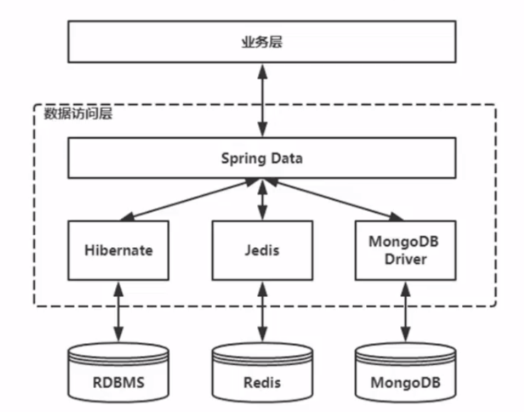

# Spring Data与JPA

### 关于Spring Data

为访问数据库提供统一的模型，包括关系型数据库、非关系数据库。



[关于JPA 与 Mybatis的技术选型可以参考这里](http://www.spring4all.com/article/391)

### Spring Data JPA 操作MySQL

首先我们先添加以下依赖：

```xml
<dependency>
  <groupId>org.springframework.boot</groupId>
  <artifactId>spring-boot-starter-web</artifactId>
</dependency>
<dependency>
  <groupId>org.springframework.boot</groupId>
  <artifactId>spring-boot-starter-data-jpa</artifactId>
</dependency>
<dependency>
  <groupId>com.h2database</groupId>
  <artifactId>h2</artifactId>
</dependency>
<dependency>
  <groupId>org.projectlombok</groupId>
  <artifactId>lombok</artifactId>
  <scope>provided</scope>
</dependency>
```

为了方便这里直接使用了嵌入式的数据库`h2`, 精简代码，项目源码里是用了`lombok`.

可以使用[h2 console](http://www.h2database.com/html/main.html)工具来查看数据。